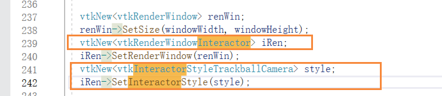

这个文件是一个C++源代码文件，主要包含了一些用于曲面计算和可视化的VTK（Visualization Toolkit）库的头文件和函数实现。以下是对文件的分析：

头文件包含部分：文件中包含了一系列VTK库的头文件，用于引入所需的类和函数声明。

命名空间：代码位于一个匿名命名空间内，这样定义的变量和函数对外部代码是不可见的。

函数实现：文件中定义了一些函数，具体功能如下：

AdjustEdgeCurvatures: 根据邻域点的曲率平均值，调整曲面边缘处的曲率值。
ConstrainCurvatures: 将曲率限制在给定的范围内。
GetBour, GetCube, GetEnneper, GetHills, GetMobius, GetRandomHills, GetSphere, GetTorus: 这些函数返回不同类型的曲面的vtkPolyData对象。
GetSource: 根据给定的曲面名称，返回对应的vtkPolyData对象。
GetDivergingLut, GetDivergingLut1: 返回不同类型的颜色映射表（Lookup Table）对象。
GetBands: 根据给定的范围和分段数，返回一组曲面标量值的范围。
GetFrequencies: 计算每个范围内标量值的频率。
AdjustFrequencyRanges: 调整频率范围，确保范围内的首尾频率非零。
PrintBandsFrequencies: 打印标量值范围和频率信息。
main函数：程序的入口函数，包含了具体的逻辑实现。

首先根据所需的曲面名称获取对应的vtkPolyData对象。
创建vtkCurvatures对象，计算曲面的高斯曲率和平均曲率，并进行相关处理。
根据曲面名称和类型进行特定的曲率处理。
将曲率数据添加到vtkPolyData对象中。
创建vtkRenderWindow和vtkRenderWindowInteractor，设置窗口大小和交互器样式。
创建vtkNamedColors对象，定义颜色属性。
创建vtkTextProperty对象，定义文本属性。
创建颜色映射表对象。
定义视口范围，用于显示不同的视图。
根据曲率类型创建相应的视图并进行渲染。
总体而言，这个文件实现了对不同类型曲面的曲率计算和可视化，并提供了一些函数用于曲率处理、颜色映射和频率统计等功能。

tangents 切线

plane 平面

normals 常态；通常标准

